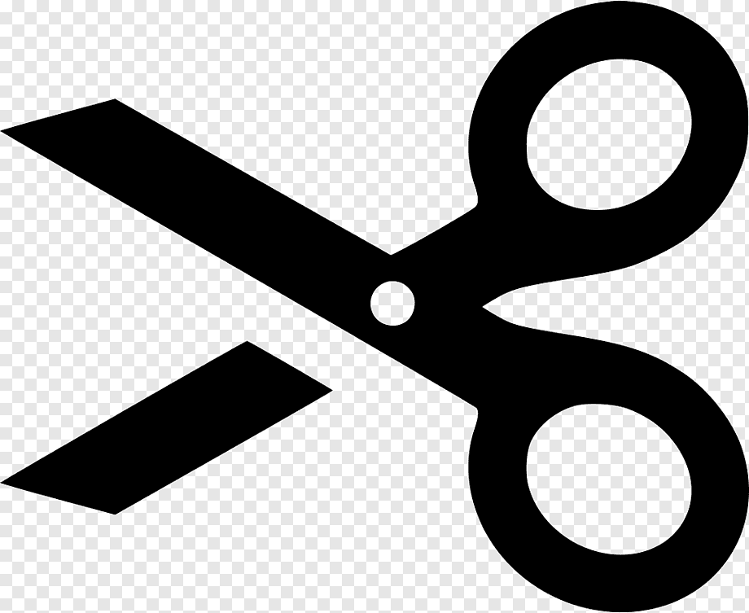
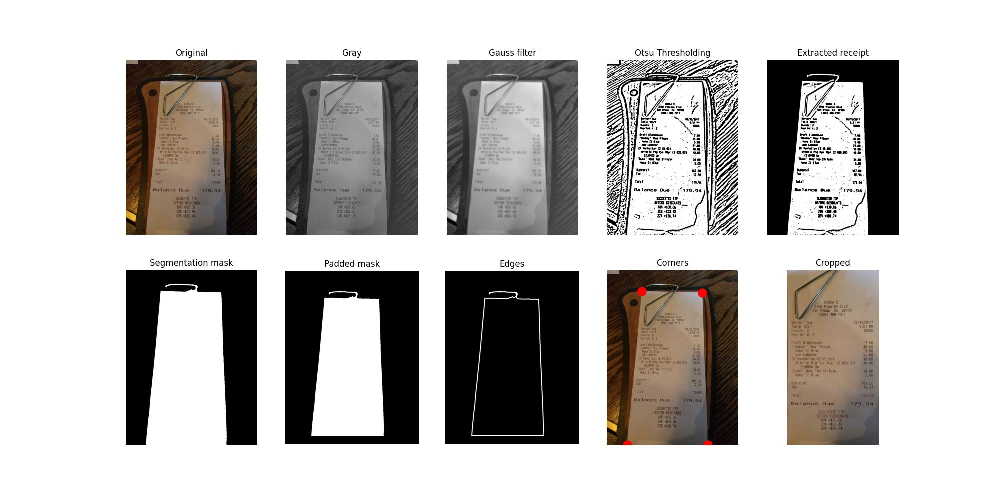
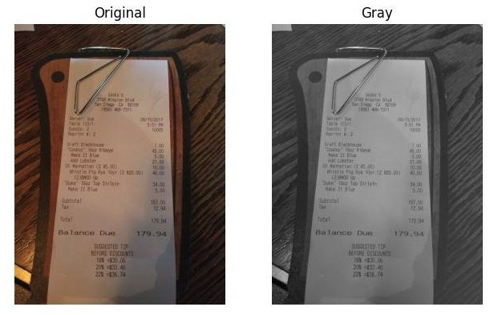
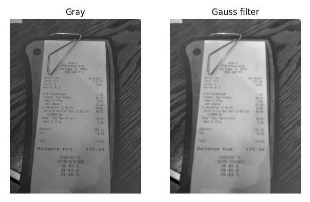
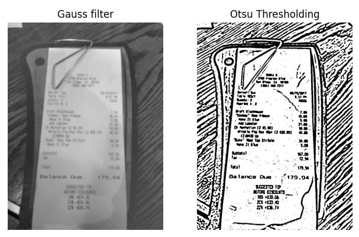
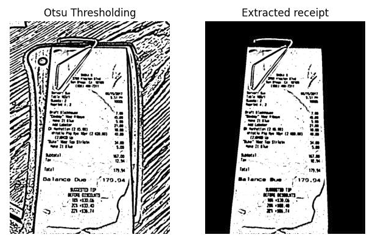
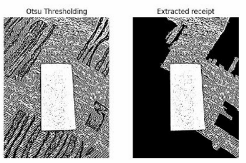
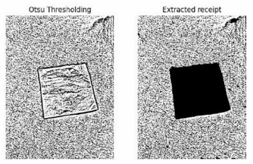

<div id="top"></div>

<!-- PROJECT LOGO -->
<br />
<div align="center">
  <a>
    
  </a>

  <h3 align="center">Document-Cropper</h3>

  <p align="center">
    Python document cropper which can be applied to images.
    <br />
    <br />
  </p>
</div>


<!-- TABLE OF CONTENTS -->
<details>
  <summary>Table of Contents</summary>
  <ol>
    <li>
      <a href="#about-the-project">About The Project</a>
      <ul>
        <li><a href="#built-with">Built With</a></li>
      </ul>
    </li>
    <li>
      <a href="#getting-started">Getting Started</a>
      <ul>
        <li><a href="#prerequisites">Prerequisites</a></li>
        <li><a href="#installation">Installation</a></li>
      </ul>
    </li>
    <li><a href="#usage">Usage</a></li>
    <li><a href="#algorithm-description">Algorithm Description</a></li>
    <li><a href="#acknowledgments">Acknowledgments</a></li>
  </ol>
</details>


<!-- ABOUT THE PROJECT -->
## About The Project




There are a several articles and GitHub repos dedicated to document segmentation; however, I didn't find one that worked right out of the box, so I created this one. It can be used for preprocessing document images for further text recognition on them or for saving them in proper format.

The description below explains the whole circumcision process. Maybe you will make up an idea of how to make it work better.

Use methods from `/src/main.py` to get started.

<p align="right">(<a href="#top">back to top</a>)</p>


### Built With

* [NumPy](https://numpy.org/)
* [SciPy](https://scipy.org/)
* [scikit-image](https://scikit-image.org/)
* [Matplotlib](https://matplotlib.org/)


<p align="right">(<a href="#top">back to top</a>)</p>


<!-- GETTING STARTED -->
## Getting Started

This is an example of how you may give instructions on setting up your project locally.
To get a local copy up and running follow these simple example steps.

### Prerequisites

This is an example of how to list things you need to use the software and how to install them.
* npm
  ```sh
  npm install npm@latest -g
  ```

### Installation

_Below is an example of how you can instruct your audience on installing and setting up your app. This template doesn't rely on any external dependencies or services._

1. Get a free API Key at [https://example.com](https://example.com)
2. Clone the repo
   ```sh
   git clone https://github.com/your_username_/Project-Name.git
   ```
3. Install NPM packages
   ```sh
   npm install
   ```
4. Enter your API in `config.js`
   ```js
   const API_KEY = 'ENTER YOUR API';
   ```

<p align="right">(<a href="#top">back to top</a>)</p>


<!-- USAGE EXAMPLES -->
## Usage

Use this space to show useful examples of how a project can be used. Additional screenshots, code examples and demos work well in this space. You may also link to more resources.

_For more examples, please refer to the [Documentation](https://example.com)_

<p align="right">(<a href="#top">back to top</a>)</p>


<!-- ALGORITHM DESCRIPTION -->
## Algorithm Description

This implementation was based on [this Inovex article](https://www.inovex.de/de/blog/digitize-receipts-computer-vision/?utm_source=yafavorites). Code from the article didn't work out of the box, so I have reworked part of the code and implemented my own corner detection algorithm.<br><br>
The algorithm consists of several steps: 
1 preprocessing; 2) corner detection; 3) cropping.<br>
I chose the most optimal methods and their hyperparameters testing each on a dataset of 200 photos.<br>

1. **Convert initial RGB image into monochrome one.**<br>
Usually documents are white and stand out strongly in the photo so we can use contrast filters for our needs. Such filters work well with monochrome images.<br>


1. **Apply Gaus filter**<br>
Gauss filter blurs the image thereby removing some artifacts. Tests showed that we can get better segmentation results using this filter.<br>


1. **Thresholding**<br>
At this step I apply thresholding as first binarization step. Usage of the thresholding method was missed in the [article](https://www.inovex.de/de/blog/digitize-receipts-computer-vision/?utm_source=yafavorites) so I tested all the thresholding methods available in skimage and chose the best one. It turned out to be Otsu thersholding with disc size of 8 pixels.<br>


1. **Document selection**<br>
After Otsu thresholding we get picture with different white zones. One of such zones is our document. At this step I am trying leave only document white zone. There is method in [skimage](https://scikit-image.org/docs/stable/api/skimage.measure.html#skimage.measure.label) which can cluster pixels from disjoit white zones. The biggest cluster is our document so I leave only it and remove all other regions.<br>
<br>
This part of the algorithm should be improved. There are two cases when extracting works incorrect. The first one is when some of background white regions is connected to the documnet's region. The second one is when some of the background regions is bigger than document. There are examples for theese problems below:<br>
 <br>  <br>
These issues should be handled somehow in the future.

<p align="right">(<a href="#top">back to top</a>)</p>


<!-- ACKNOWLEDGMENTS -->
## Acknowledgments

Use this space to list resources you find helpful and would like to give credit to. I've included a few of my favorites to kick things off!

* [Choose an Open Source License](https://choosealicense.com)
* [GitHub Emoji Cheat Sheet](https://www.webpagefx.com/tools/emoji-cheat-sheet)
* [Malven's Flexbox Cheatsheet](https://flexbox.malven.co/)
* [Malven's Grid Cheatsheet](https://grid.malven.co/)
* [Img Shields](https://shields.io)
* [GitHub Pages](https://pages.github.com)
* [Font Awesome](https://fontawesome.com)
* [React Icons](https://react-icons.github.io/react-icons/search)

<p align="right">(<a href="#top">back to top</a>)</p>