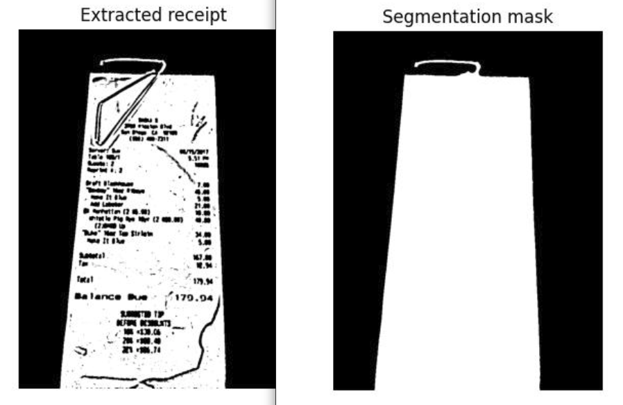
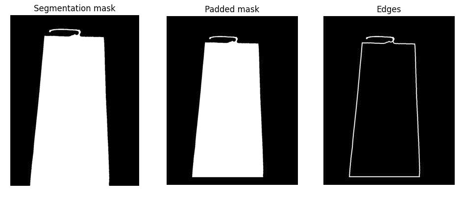
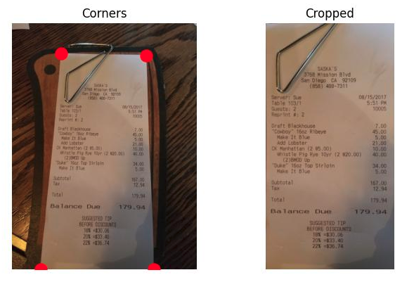

<div id="top"></div>

<!-- PROJECT LOGO -->
<br />
<div align="center">
  <a>
    
  </a>

  <h3 align="center">Document-Cropper</h3>

  <p align="center">
    Python document cropper which can be applied to images.
    <br />
    <br />
  </p>
</div>


<!-- TABLE OF CONTENTS -->
<details>
  <summary>Table of Contents</summary>
  <ol>
    <li>
      <a href="#about-the-project">About The Project</a>
      <ul>
        <li><a href="#built-with">Built With</a></li>
      </ul>
    </li>
    <li>
      <a href="#installation">Getting Started</a>
    </li>
    <li><a href="#usage">Usage</a></li>
    <li><a href="#algorithm-description">Algorithm Description</a></li>
    <li><a href="#acknowledgments">Acknowledgments</a></li>
  </ol>
</details>


<!-- ABOUT THE PROJECT -->
## About The Project


There are a several articles and GitHub repos dedicated to document segmentation; however, I didn't find one that worked right out of the box, so I created this one. It can be used for preprocessing document images for further text recognition on them or for saving them in proper format.

The description below explains the whole circumcision process. Maybe you will make up an idea of how to make it work better.


<p align="right">(<a href="#top">back to top</a>)</p>


### Built With

* [NumPy](https://numpy.org/)
* [SciPy](https://scipy.org/)
* [scikit-image](https://scikit-image.org/)
* [Matplotlib](https://matplotlib.org/)


<p align="right">(<a href="#top">back to top</a>)</p>


<!-- Installation -->
## Installation

This package can be easily installed via pip

  ```sh
  pip install document-cropper
  ```

<p align="right">(<a href="#top">back to top</a>)</p>


<!-- USAGE EXAMPLES -->
## Usage

```Python
import document_cropper as dc
```

To crop image you should use:
```Python
dc.crop_image("path_to_image.jpg", "name_for_the_result.jpg")
```

 If you want to continue processing the photo and save the cropping result to a variable:
 ```Python
cropped = dc.crop_image("path_to_image.jpg")
```

Also you can provide input as np.ndarray
```Python
from skimage import io

cropped = dc.crop_image(image=image)
```

If you want to see all stages of processing you can use:
```Python
# Save the stages as image
dc.crop_image_pipeline("path_to_image.jpg", "name_for_the_result.jpg")

# Show the stages as matplotlib figure
dc.crop_image_pipeline("path_to_image.jpg")
```


_**main.py** file contains examples of using these methods<br><br>
There are also **demostration()** methods in this repository which can be uncommented in **main.py**. They show how the code from the files works in order to make it easier to figure out what the methods are doing. This **demonstration()** methods present only in this repository and do not come with the package when installed via pip_
```Python
# segmentation.demonstration()
# corner_detection.demonstration()
# image_cropper.demonstration()
# cropper_pipeline.demonstration()
```

<p align="right">(<a href="#top">back to top</a>)</p>


<!-- ALGORITHM DESCRIPTION -->
## Algorithm Description

This implementation was based on [this Inovex article](https://www.inovex.de/de/blog/digitize-receipts-computer-vision/?utm_source=yafavorites). Code from the article didn't work out of the box, so I have reworked part of the code and implemented my own corner detection algorithm.<br><br>
The algorithm consists of several steps: 
1 preprocessing; 2) corner detection; 3) cropping.<br>
I chose the most optimal methods and their hyperparameters testing each on a dataset of 200 photos.<br>

1. **Convert initial RGB image into monochrome one.**<br>
Usually documents are white and stand out strongly in the photo so we can use contrast filters for our needs. Such filters work well with monochrome images.<br>


1. **Apply Gaus filter**<br>
Gauss filter blurs the image thereby removing some artifacts. Tests showed that we can get better segmentation results using this filter.<br>


1. **Thresholding**<br>
At this step I apply thresholding as first binarization step. Usage of the thresholding method was missed in the [article](https://www.inovex.de/de/blog/digitize-receipts-computer-vision/?utm_source=yafavorites) so I tested all the thresholding methods available in skimage and chose the best one. It turned out to be Otsu thersholding with disc size of 8 pixels.<br>


1. **Document selection**<br>
This is the most important step of the algorithm. Mistakes on this step cause the whole cropping process to fail.<br>
After Otsu thresholding we get picture with different white zones. One of such zones is our document. At this step I am trying leave only document white zone. There is method in [skimage](https://scikit-image.org/docs/stable/api/skimage.measure.html#skimage.measure.label) which can cluster pixels from disjoit white zones. The biggest cluster is our document so I leave only it and remove all other regions.<br>
<br>
This part of the algorithm should be improved. There are two cases when extracting works incorrect. The first one is when some of background white regions is connected to the documnet's region. The second one is when some of the background regions is bigger than document. There are examples for theese problems below:<br>
 <br>  <br>
These issues should be handled somehow in the future.

1. **Fill holes**<br>
At this step we remove holes left by text.<br>
Two different binary holes methods from skimage and scipy were used. I went through different values of the hyperparameters and found the best ones. Also I tested the order of the application of these methods.<br><br>
There is another issue. In the original [article](https://www.inovex.de/de/blog/digitize-receipts-computer-vision/?utm_source=yafavorites) this step of binary closing was performed before extracting document region (previous step). Changing the order of applying theese methods gave significant increase in quality. If we perform binary closing before previous step we will glue background to the document.<br>
<br>

1. **Corner detection**<br>
Now we have segmentation mask of the document and we can find document's corners. For this perpose I extract one pixel edge from obtained mask. There is a problem with edge selection if the document goes out of the image (as in the example below). In such a case method for edges extrcation loses some of the edges so I decided to use padding with __False__ values before edge extraction. It solved the problem.<br><br>
Now we have edge pixels. Some of them belong to sides of the mask others belong to corners. Let's consider side pixel. If we look at surrounding of such a pixel we will understand that it has about half white neighbors and half of black neighbors. If we consider corner pixels then we will get that they have much less than half of white pixels. By this way we can decide guess which pixels are more likely to belong to the corners.<br><br>
Finally we should decide which 4 pixels will we take for corners. I go through the obtained list of pixels and select the closest one for each of the corners of the image.<br>
<br>
Algorithm described above is totally my idea. In other articles an repos the authors try to use Hough lines tranform. They try to find straight lines in seegmentation mask and then try to find their intrsections. Finally, the choose corners from theese intersections. I tested some varints of this approach and it did not give good results.

1. **Сutting out**<br>
When coordinates of corners are found we can finally cut the document from the image and rescale it to the correct form.<br>
<br>

<p align="right">(<a href="#top">back to top</a>)</p>


<!-- ACKNOWLEDGMENTS -->
## Acknowledgments

* [Inovex article](https://www.inovex.de/de/blog/digitize-receipts-computer-vision/?utm_source=yafavorites)
* [Another approach using Open CV library](https://developers.goalist.co.jp/entry/2019/02/13/150126)
* [Nanonets article related to the theme](https://nanonets.com/blog/receipt-ocr/)
* [Related reppository (code from it did not work for me)](https://github.com/jackfong123/ReceiptSegmentation)

<p align="right">(<a href="#top">back to top</a>)</p>